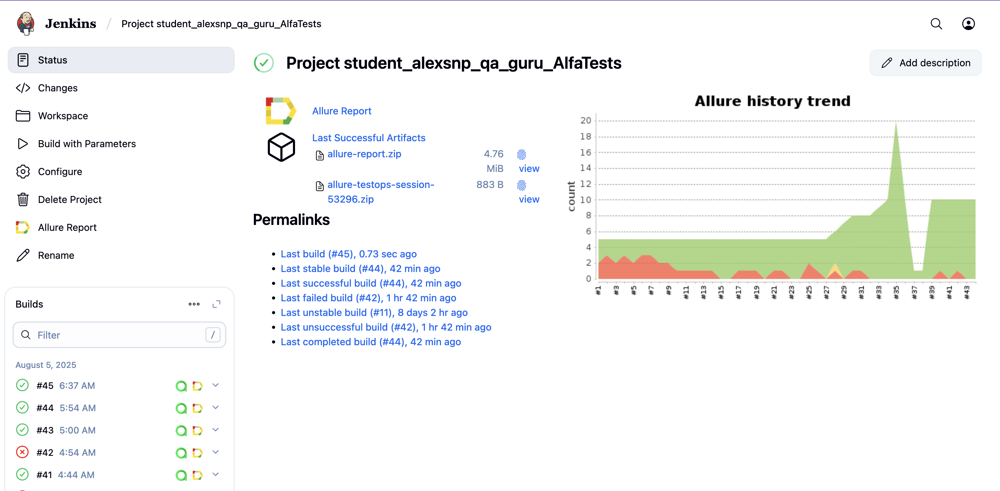
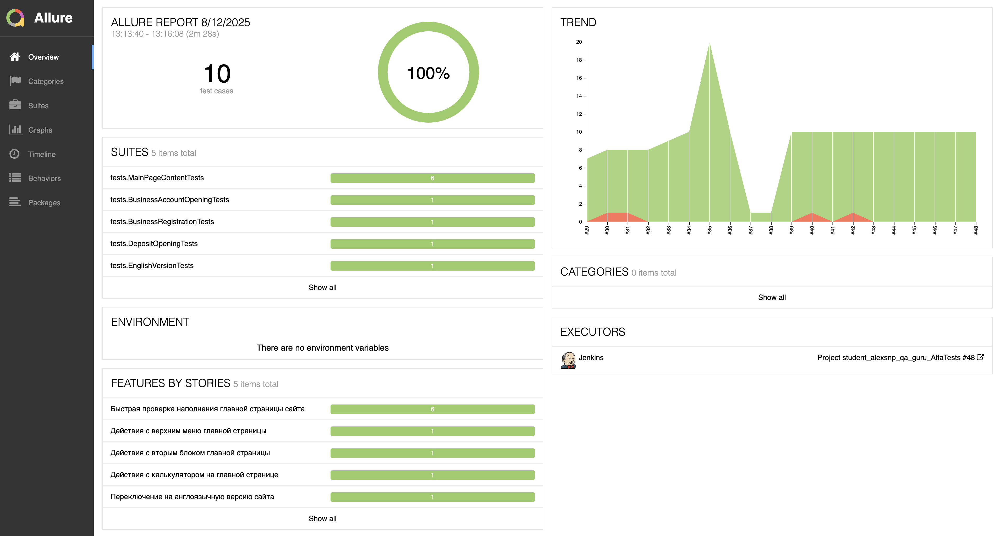
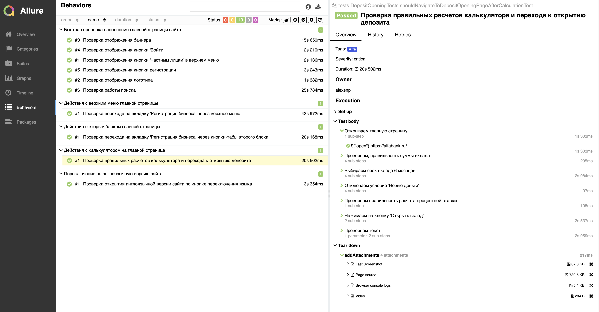
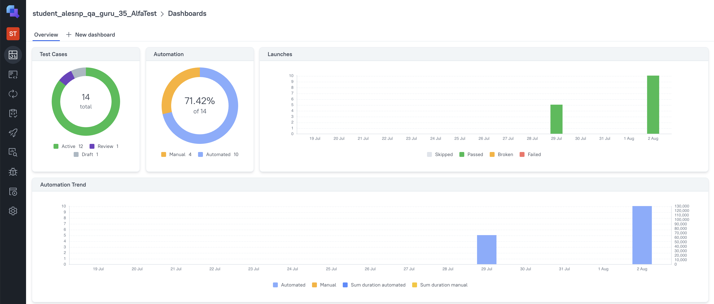


# Проект по автоматизации тестирования для компании [Alfabank](https://alfabank.ru/)

> Альфа‑Банк — крупнейший частный банк России, предоставляющий полный спектр финансовых услуг для розничных и корпоративных клиентов, включая банковские продукты, инвестиционный банкинг и управление активами

## **Содержание:**
____

* <a href="#tools">Технологии и инструменты</a>

* <a href="#cases">Примеры автоматизированных тест-кейсов</a>

* <a href="#jenkins">Сборка в Jenkins</a>

* <a href="#console">Запуск из терминала</a>

* <a href="#allure">Allure отчет</a>

* <a href="#allure-testops">Интеграция с Allure TestOps</a>

* <a href="#jira">Интеграция с Jira</a>

* <a href="#telegram">Уведомление в Telegram при помощи бота</a>

* <a href="#video">Примеры видео выполнения тестов на Selenoid</a>
____
<a id="tools"></a>
## <a name="Технологии и инструменты">**Технологии и инструменты:**</a>

<p align="center">  
<a href="https://www.jetbrains.com/idea/"></a>  
<a href="https://www.java.com/"></a>  
<a href="https://github.com/"></a>  
<a href="https://junit.org/junit5/"></a>  
<a href="https://gradle.org/"></a>  
<a href="https://selenide.org/"></a>  
<a href="https://aerokube.com/selenoid/"></a>  
<a href="ht[images](images)tps://github.com/allure-framework/allure2"></a> 
<a href="https://qameta.io/"></a>   
<a href="https://www.jenkins.io/"></a>  
<a href="https://www.atlassian.com/ru/software/jira/"></a>  
<a href="https://www.telegram.org"></a> 
</p>

____
<a id="cases"></a>
## <a name="Примеры автоматизированных тест-кейсов">**Примеры автоматизированных тест-кейсов:**</a>
____

- ✓ *Проверка англоязычной версии сайта*
- ✓ *Проверка работы поиска и логики ответа*
- ✓ *Проверка расчетов калькулятора вклада*
- ✓ *Проверка раскрытия меню при наведении*
- ✓ *Проверка переключения кнопок в главном меню*
- ✓ *Проверка логотипа компании на главной странице*
- ✓ *Проверка отображения баннера на главной странице*
- ✓ *Проверка открытия вкладки "Открытие расчетного счета"*


____
<a id="jenkins"></a>
## </a><a name="Сборка"></a>Сборка в [Jenkins](https://jenkins.autotests.cloud/job/student_alesnp_qa_guru_35_AlfaTest/)</a>
____
<p align="center">  
<a href="https://jenkins.autotests.cloud/job/student_alesnp_qa_guru_35_AlfaTest/"></a>  
</p>


### **Параметры сборки в Jenkins:**

- *selenoid_url (логин, пароль и адрес удаленного сервера Selenoid)*
- *BROWSER (браузер, по умолчанию chrome)*
- *BROWSER_VERSION (версия браузера, по умолчанию 128.0)*
- *BROWSER_SIZE (размер окна браузера, по умолчанию 1600x900)*

<a id="console"></a>
## Команды для запуска из терминала
___
***Локальный запуск:***
```bash  
gradle clean alfa_test
```

***Удалённый запуск через Jenkins:***
```bash  
clean alfa_test
-Dselenoid_url=${selenoid_url}
-Dbrowser=${BROWSER}
-Dbrowser.version=${BROWSER_VERSION}
-Dbrowser_size=${BROWSER_SIZE}
```
___
<a id="allure"></a>
## </a> <a name="Allure_Report"></a>Allure [отчет](https://jenkins.autotests.cloud/job/Project%20student_alexsnp_qa_guru_AlfaTests/36/allure/)</a>
___

### *Основная страница отчёта*

<p align="center">  
  
</p>  

### *Тест-кейсы*

<p align="center">  
  
</p>

### *Графики*

  <p align="center">  

</p>

___
<a id="allure-testops"></a>
## </a>Интеграция с <a target="_blank" href="https://allure.autotests.cloud/project/4842/dashboards">Allure TestOps</a>
____
### *Allure TestOps Dashboard*

<p align="center">  
  
</p>  

### *Ручные тест-кейсы*

<p align="center">  
  
</p>

### *Авто тест-кейсы*

<p align="center">  
  
</p>

___
<a id="jira"></a>
## </a> Интеграция с <a target="_blank" href="https://jira.autotests.cloud/browse/HOMEWORK-682">Jira</a>
____
<p align="center">  
  
</p>

____
<a id="telegram"></a>
## </a> Уведомление в Telegram при помощи бота
____
<p align="center">  
  
</p>

____
<a id="video"></a>
## </a> Примеры видео выполнения тестов на Selenoid
____
<p align="center">
   
</p>

